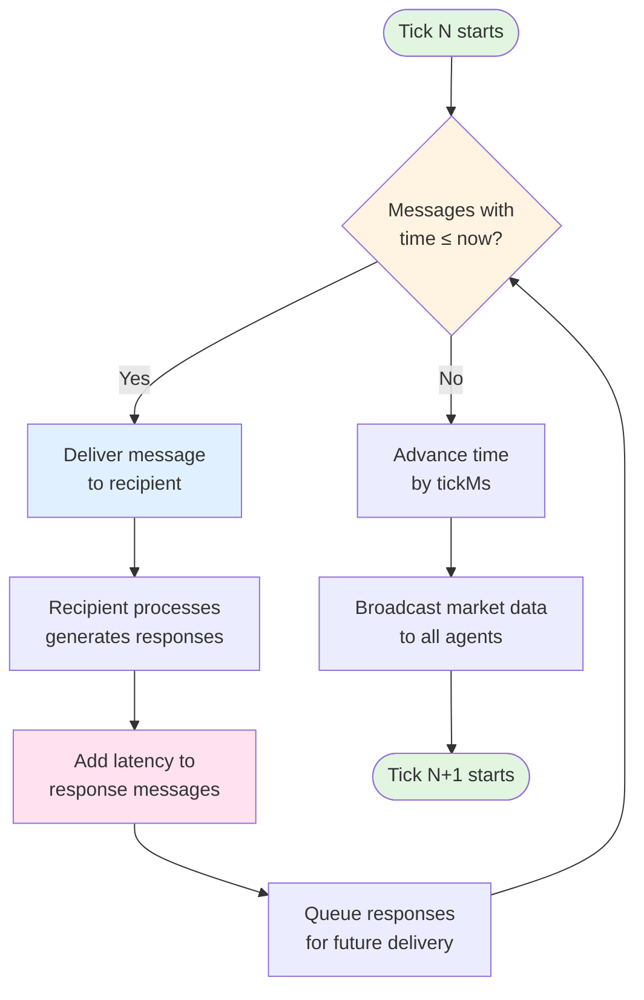

# Market Simulation Engine

> Event-driven, deterministic financial market simulator for strategy testing, education, and market microstructure research.

**Inspired by:** [ABIDES](https://github.com/abides-sim/abides) (Agent-Based Interactive Discrete Event Simulation)

---

## What is this?

A self-contained trading simulation platform that recreates a complete exchange environment inside your application. Multiple agents trade with different strategies while you observe market dynamics in real-time or participate yourself through the API.

**Use cases:** Testing trading algorithms, studying market behavior, learning market microstructure, HFT research, strategy backtesting.

**Key feature:** Fully deterministic - run the same simulation twice with identical parameters, get identical results every time.

---

## Key Concepts

### Event-Driven Architecture

All interactions happen through message passing. Agents don't call exchange functions directly - they send messages that travel through a priority queue, get processed, and generate response messages. This models real-world async communication and network delays.

### Deterministic Execution

Every simulation run with the same parameters produces identical results. Events are processed in strict order, random numbers use fixed seeds, time advances in discrete steps. Critical for reproducible testing and debugging.

### Discrete Time (Ticks)

Time doesn't flow continuously - it moves in discrete steps called ticks (typically 200ms). On each tick, the Kernel processes accumulated events, delivers messages, and updates market state. Enables deterministic simulation and clear event ordering.

### Latency Model

Simulates real-world network and processing delays. When you send an order, it doesn't execute instantly - there's uplink latency (you → exchange), processing time, and downlink latency (exchange → you). Essential for HFT strategy testing.

---

## Architecture

### Kernel

The core orchestrator that manages time, routes messages, and coordinates all components.

**Responsibilities:**

- **Time management:** Advances virtual clock in discrete ticks (nanosecond precision)
- **Message queue:** Priority queue of events sorted by scheduled delivery time
- **Routing:** Adds latency to messages, delivers them at the right virtual time
- **Broadcast:** Distributes market data updates to all subscribed agents

**How it works:** On each tick, Kernel processes all queued messages with timestamp ≤ current time, delivers them to recipients, collects new messages generated during processing, adds appropriate latencies, and schedules them for future delivery.

**Event Loop Diagram:**



### Priority Queue

Stores messages sorted by delivery time. When Kernel advances time, it pops all messages scheduled for that moment and delivers them. More efficient than checking every message on every tick.

**Structure:** Each message has `{from, to, type, body, at}` where `at` is nanosecond timestamp for delivery.

### Message Flow

```
Agent → Kernel.send() → [add latency] → Queue → [time advances] → Deliver → Recipient
                                                                              ↓
                                                        [response messages] ← process
```

**Example:** Trader sends limit order → Kernel adds 200ms network latency → Queues for future delivery → Exchange receives and processes → Sends confirmation back → Kernel adds 200ms return latency → Trader receives confirmation.

---

## Core Components

### Exchange Agent

The central counterparty that maintains the order book and executes trades.

**What it does:**

- Receives order messages (limit, market, cancel, modify)
- Validates orders (positive prices/quantities, correct symbol)
- Passes to OrderBook for matching
- Sends confirmations, executions, rejections back to traders
- Broadcasts market data snapshots to all participants

**Message types handled:**

- `LIMIT_ORDER` → validate → match → send `ORDER_ACCEPTED` + `ORDER_EXECUTED` (if matched)
- `MARKET_ORDER` → validate → execute → send executions or `ORDER_REJECTED` (no liquidity)
- `CANCEL_ORDER` → remove from book → send `ORDER_CANCELLED`
- `MODIFY_ORDER` → update price/qty → send `ORDER_ACCEPTED`
- `QUERY_SPREAD` → return snapshot of bid/ask levels

### Order Book

Pure matching engine that maintains bid/ask queues and executes trades.

**Core logic:**

- **Price-time priority:** Orders sorted by price (best first), then timestamp (earlier first)
- **Matching:** On new limit order, checks if it crosses spread → executes against opposite side → repeats until no match or order exhausted
- **Market orders:** Sweep through opposite side taking liquidity until filled or book empty

**Data structure:**

```typescript
bids: LimitOrder[]  // sorted desc by price, asc by timestamp
asks: LimitOrder[]  // sorted asc by price, asc by timestamp
```

**Operations:** O(n log n) for sorting after modifications, O(1) for peek best bid/ask, O(n) for matching.

### Latency Model

Simulates real-world communication delays between agents and exchange.

**Two-stage RPC model:**

- **Uplink (agent → exchange):** ~200ms network latency
- **Processing (exchange):** ~5-300ms compute time
- **Downlink (exchange → agent):** ~200ms + jitter

**Why it matters:** In HFT, microseconds count. Strategies that work in zero-latency simulation often fail with realistic delays. This model lets you test latency-sensitive strategies.

---

## Agent Types

All agents inherit from base `Agent` class and implement event handlers: `kernelStarting()`, `wakeup()`, `receive()`.

### Market Maker

Provides liquidity by continuously quoting bid/ask prices around fair value.

**Strategy:**

- Maintains ladder of limit orders on both sides (e.g., 10 levels, 2000 qty each)
- Centers around blended mid price + fundamental value from Oracle
- Adjusts spread based on volatility (wider when uncertain)
- Skews quotes based on inventory (moves prices to reduce position)
- Refreshes quotes periodically, cancels/modifies stale orders

**Important: Market Makers don't teleport** - they smoothly follow price movements by **modifying existing orders**:

- Oracle updates fundamental: $400 → $405
- MM calculates new desired quote levels around $405
- Instead of canceling all orders and placing new ones (expensive, loses queue priority), MM uses `MODIFY_ORDER`:
  - Old bid at $399.50 → modify to $404.50 (moves with market)
  - Old ask at $400.50 → modify to $405.50
- Only modifies orders that drifted beyond hysteresis threshold (e.g., 10 cents)
- This creates smooth, gradual price discovery as MM quotes "walk" to new levels

**Why this matters:** Realistic market making. Real MMs don't spam cancel/replace - they modify to maintain queue priority and reduce message traffic. This is why you see gradual spread tightening/widening rather than instant jumps.

**Parameters:** `levels`, `levelQty`, `baseSpread`, `alphaVol` (volatility multiplier), `invSkewCentsPerQty` (inventory penalty), `priceHysteresisCents` (modify threshold).

**Behavior:** Every 150-300ms, recalculates desired quote prices, modifies orders that drifted too far, cancels extras, places missing levels. Responds to fills by adjusting inventory skew.

### Value Agent (Fundamental Trader)

Trades based on estimated fundamental value using Kalman-like filtering.

**Strategy:**

- Maintains belief about fundamental value (mean-reverting OU process)
- Observes noisy signal from Oracle, updates belief via Kalman filter
- Projects value forward to forecast horizon
- If forecast > mid → buy, if forecast < mid → sell
- Mixes aggressive market orders with passive limit orders

**Parameters:** `rBar` (long-term mean), `kappa` (mean reversion speed), `sigmaN` (observation noise), `lambdaA` (action frequency).

**Behavior:** Wakes at Poisson intervals, updates fundamental estimate, compares to current mid, places orders accordingly. Cancels previous quotes before each action (ABIDES-style).

### Trade Agent (Trend Follower)

Technical trader using EMA crossover strategy.

**Strategy:**

- Tracks short/long exponential moving averages on last price
- When short EMA exceeds long by threshold → buy signal
- When short EMA falls below long by threshold → sell signal
- No signal → places passive limit orders near bid/ask

**Parameters:** `shortPeriod`, `longPeriod`, `thresholdBp`, `signalQty`.

**Behavior:** Updates EMAs on each price tick, checks for signals, sends market orders on crossovers, maintains passive quotes otherwise. Cancels orders older than TTL.

### OBI Agent (Order Book Imbalance)

Trades based on liquidity imbalance in order book depth.

**Strategy:**

- Measures bid vs ask liquidity in top K levels
- Computes `bid_pct = bid_liq / (bid_liq + ask_liq)`
- If `bid_pct > 0.5 + threshold` → long bias (expect price up)
- If `bid_pct < 0.5 - threshold` → short bias (expect price down)
- Uses trailing stop to exit positions

**Parameters:** `levels` (depth to measure), `entryThreshold`, `trailDist`.

**Behavior:** Wakes periodically, calculates imbalance, enters/exits positions via market orders based on signals.

### Noise Taker (Uninformed Flow)

Generates random buy/sell market orders to create trading volume.

**Strategy:**

- Poisson arrival process (random timing)
- Fat-tailed order sizes (most small, occasional large)
- Regime-based buy/sell bias (temporary imbalances)

**Parameters:** `freqNs`, `smallMaxQty`, `tailProb`, `largeMaxQty`.

**Behavior:** Wakes at regular intervals, flips biased coin for side, samples order size from distribution, sends market order.

### Oracle Agent

Provides external "fundamental value" signal that evolves over time.

**Modes:**

- **OU (Ornstein-Uhlenbeck):** Mean-reverting process with jumps (additive)
- **JDM (Jump-Diffusion Merton):** GBM with Poisson jumps (multiplicative)

**Purpose:** Gives informed agents (ValueAgent) a noisy signal about "true" asset value. Uninformed agents (NoiseTaker, TradeAgent) don't observe this.

**Parameters:** OU mode - `mu` (long-term mean), `kappa` (reversion speed), `sigmaCents` (diffusion), `lambdaAnn` (jump frequency).

**Behavior:** Wakes every ~150ms, updates fundamental value using stochastic process, broadcasts `ORACLE_TICK` to all agents.

### Scenario Oracle (New)

Follows predefined price trajectory for demos and testing.

**Strategy:**

- Takes array of `{atSec, price, volatility}` waypoints
- Interpolates smoothly between points
- Adds configurable noise around target path

**Use case:** Create specific market scenarios (bull run, crash, sideways) for reproducible testing.

### Whale Agent (New)

Large trader with intentional market impact strategies.

**Strategies:**

- **Accumulate:** Gradually buy target quantity over period
- **Distribute:** Gradually sell position over period
- **Pump & Dump:** Aggressive buying then selling
- **Scheduled:** Execute predefined actions at specific times

**Purpose:** Simulate large informed traders or manipulative behavior. Creates interesting price dynamics and tests how other agents respond to big orders.

### Human Trader

Special agent for manual trading through API.

**Features:**

- Place/cancel/modify orders via REST endpoints
- Tracks cash and position
- WebSocket for real-time market data
- Used for interactive testing and demos

---

## Message Flow & Event Loop

### Typical Order Flow

```
1. Agent decides to trade → calls this.send(exchangeId, LIMIT_ORDER, {...})
2. Kernel.send() adds network latency (200ms) → schedules delivery
3. Time advances via ticks → message delivery time reached
4. Kernel delivers message to Exchange
5. Exchange validates, passes to OrderBook
6. OrderBook matches, generates executions
7. Exchange sends ORDER_ACCEPTED + ORDER_EXECUTED messages
8. Kernel adds return latency → schedules deliveries
9. Messages arrive back at agent
10. Agent updates internal state (position, P&L)
```

### How Agents Wake Up

**Scheduled wakeups:** Agent calls `this.setWakeup(futureTime)` → Kernel sends `WAKEUP` message scheduled for that time → When time arrives, agent's `wakeup(t)` method called.

**Message-driven:** Agent receives market data, order confirmations, executions → `receive(t, msg)` method called → Agent processes and may send new messages or schedule future wakeup.

### Why Ticks Are Needed

**Without ticks:** Kernel would need to continuously check if any messages are ready, inefficient.

**With ticks:** Kernel sleeps between ticks (200ms wall-clock time), wakes up, processes all virtual events for that tick in batch, updates UI, then sleeps again.

**For humans:** Ticks synchronize simulation clock with real wall-clock time so humans can interact. Virtual time = ticks × tickMs. Real time = wall-clock. API requests happen in real time, but execute in virtual time on next tick.

---

## How Price Formation Works

### Price Discovery Process

1. **Oracle** broadcasts fundamental value signal (e.g., $400.00)
2. **Market Makers** center quotes around this value:
   - Place bids: $399.50, $399.00, $398.50...
   - Place asks: $400.50, $401.00, $401.50...
   - Spread = $1.00 between best bid/ask
3. **Value Agents** observe Oracle signal (with noise), update beliefs
4. If belief > current mid → **Value Agents buy** (market + limit orders)
5. **Market Makers** see buying pressure:
   - Inventory builds up (selling into buys)
   - Skew quotes higher to shed inventory: new center = $400.20
   - **Smoothly modify existing orders** (not cancel/replace):
     - Bid $399.50 → modify to $399.70
     - Ask $400.50 → modify to $400.70
   - Widen spread due to uncertainty: $1.00 → $1.20
6. **Oracle updates** fundamental to $402.00 (news event)
7. **Market Makers gradually adjust**:
   - Calculate new center around $402
   - Modify orders that drifted >10 cents (hysteresis)
   - Bids "walk up": $399.70 → $400.80 → $401.50
   - Asks "walk up": $400.70 → $401.80 → $402.50
   - Price smoothly transitions $400 → $402
8. **Trend Followers** see price rising → EMAs cross → **join buying**
9. **OBI Agents** see bid liquidity > ask → **buy signal**
10. More buying → MM quotes walk higher → **new equilibrium at $402**
11. **Noise Takers** randomly buy/sell throughout → **volume & volatility**

**Key insight:** Price doesn't jump instantly when Oracle changes. Market Makers smoothly modify their quotes over multiple wakeups, creating gradual price discovery. This mimics real markets where liquidity providers adjust quotes incrementally as information arrives.

### Why Market Makers Don't Teleport

**Wrong approach (unrealistic):**

```
Oracle: $400 → $405
MM: Cancel all 20 orders, place 20 new orders at $405 levels
Result: Loses queue priority, creates order spam, instant price jump
```

**Correct approach (implemented):**

```
Oracle: $400 → $405
MM wakeup 1: Modify orders that drifted >10 cents (4 orders)
  $399.50 → $402.00, $400.50 → $403.00
MM wakeup 2: Modify 4 more orders
  $399.00 → $401.50, $401.00 → $403.50
MM wakeup 3: Modify remaining orders
  $398.50 → $401.00, $401.50 → $404.00
Result: Smooth transition over ~750ms, maintains queue priority where possible
```

This creates realistic price dynamics: gradual spread tightening/widening, smooth transitions, no instant jumps unless big market order hits.

### Role of Each Agent Type

**Market Makers:** Price setters. Their quotes define the spread. Profit from spread, lose from adverse selection.

**Value Agents:** Informed traders. Move price toward fundamental. Profit from knowing "true" value.

**Trend Followers:** Momentum traders. Amplify moves. Can create overshoots.

**OBI Agents:** Microstructure traders. Exploit short-term imbalances. Add liquidity pressure.

**Noise Takers:** Uninformed flow. Provide counterparty to informed traders. Create volume.

**Oracle:** External truth. Represents news, fundamentals, macro factors.

**Whale:** Large informed trader. Creates intentional price impact. Tests market resilience.

### Market Quality Metrics

**Spread:** Difference between best bid and ask. Tighter = more liquid, efficient market. Market makers compete to narrow spread, volatility widens it.

**Depth:** Total quantity available at top N levels. More depth = resilient to large orders. Value agents add depth, noise takers consume it.

**Volatility:** Price fluctuation magnitude. Increases with uncertainty, shocks, imbalances. Decreases as market makers stabilize.

**Price efficiency:** How quickly price reflects fundamental value. Faster = more informed traders, better price discovery.

---

## API & Human Interaction

### REST Endpoints

```
GET /book/:symbol          # Current order book snapshot (bids, asks, last)
GET /balances              # Human agent cash and positions
GET /orders                # Human agent open orders
POST /order                # Place order {type, symbol, side, price?, qty}
PATCH /order/:id           # Modify order {price?, qty?}
DELETE /order/:id          # Cancel order
```

### WebSocket Channels

```
ws://localhost:3000/ws

Channels:
- "trade"  → every execution {price, qty, maker, taker, side}
- "md"     → market data snapshots {symbol, bids, asks, last}
- "oracle" → fundamental value updates {ts, fundamental, mode}
- "order"  → order logs (placements, cancels, modifies)
- "reject" → order rejections {reason, refType}
```

### How Humans Trade

1. Connect to WebSocket → receive market data stream
2. Observe order book, decide on trade
3. Send POST /order → order enters simulation on next tick
4. Receive confirmation via WebSocket
5. If matched, receive execution notifications
6. Position and P&L updated in real-time

**Advantage of ticks:** Human sees consistent view. Without ticks, book would update asynchronously mid-decision.

**Subscribe:**

```javascript
ws.send(
  JSON.stringify({
    type: "subscribe",
    channel: "trade",
    symbol: "BTC-USDT",
  })
);
```

**Receive:**

```javascript
{
  "channel": "trade",
  "event": {
    "ts": 1234567890,
    "symbol": "BTC-USDT",
    "price": 40050,
    "qty": 100,
    "maker": 3,
    "taker": 5,
    "makerSide": "SELL"
  }
}
```

## Quick Example

```javascript
const ws = new WebSocket("ws://localhost:3000/ws");

ws.onopen = () => {
  ws.send(
    JSON.stringify({
      type: "subscribe",
      channel: "trade",
      symbol: "BTC-USDT",
    })
  );
};

ws.onmessage = (event) => {
  const msg = JSON.parse(event.data);
  if (msg.channel === "trade") {
    console.log(`Trade: $${msg.event.price / 100} x ${msg.event.qty}`);
  }
};

// Place order via REST
fetch("http://localhost:3000/order", {
  method: "POST",
  headers: { "Content-Type": "application/json" },
  body: JSON.stringify({
    type: "LIMIT",
    symbol: "BTC-USDT",
    side: "BUY",
    price: 40000,
    qty: 100,
  }),
});
```

## Configuration

### Config Structure

```json
{
  "name": "simulation-name",
  "durationMs": 3600000, // 1 hour (0 = infinite)
  "tickMs": 200, // tick interval
  "latency": {
    "rpcUpMs": 200, // network up
    "rpcDownMs": 200, // network down
    "computeMs": 5, // processing
    "downJitterMs": 50 // random variation
  },
  "symbols": [
    {
      "symbol": "BTC-USDT",
      "agents": [
        {
          "type": "MarketMaker",
          "count": 2,
          "params": { "levels": 10, "baseSpread": 50 }
        }
      ]
    }
  ]
}
```

### Agent Parameters

Each agent type has configurable parameters affecting behavior:

**Market Maker:** `levels`, `levelQty`, `baseSpread`, `alphaVol`, `invSkewCentsPerQty`  
**Value Agent:** `rBar`, `kappa`, `sigmaN`, `percentAggr`, `size`  
**Trade Agent:** `shortPeriod`, `longPeriod`, `thresholdBp`, `signalQty`  
**Noise Taker:** `freqNs`, `smallMaxQty`, `tailProb`, `largeMaxQty`  
**Oracle:** `mode`, `mu`, `sigma`, `lambda`

### Tuning for Different Behaviors

**High volatility:** Increase Oracle sigma, add Whale agents, reduce Market Maker count  
**High liquidity:** More Market Makers, larger `levelQty`  
**Trending market:** More Trend Followers, Whale accumulation strategy  
**Ranging market:** Strong Market Makers, weak Oracle signal

---

## Future Directions

### Blockchain Integration

Current RPC-based message passing naturally extends to blockchain settlement:

- Off-chain order matching (current simulation)
- On-chain trade settlement (batch transactions)
- Smart contract as Exchange agent
- L2 rollups for scalability

**Latency model** already mimics blockchain confirmation times. Easy transition to actual on-chain execution.

### High-Frequency Trading Research

Built-in latency simulation enables HFT studies:

- Latency arbitrage strategies
- Co-location benefits (reduced latency agents)
- Queue priority gaming
- Toxic flow detection

**Nanosecond precision** allows modeling microsecond-level advantages realistic in modern HFT.

### Machine Learning Integration

Agents can be neural networks:

- RL agents learning optimal market making
- Deep learning for price prediction
- Imitation learning from real trader data
- Adversarial agents testing robustness

**Deterministic execution** critical for reproducible RL training.

### Market Manipulation Detection

Simulate manipulative strategies, test detection:

- Spoofing (large fake orders)
- Layering (multiple fake levels)
- Pump & dump (Whale agent already does this)
- Wash trading

**Controlled environment** lets you generate labeled data for ML classifiers.

---

## Technical Details

### Time Representation

- **Nanoseconds (int64):** Virtual time measured in nanoseconds for precision
- **Ticks:** Discrete wall-clock intervals (typically 200ms)
- **Conversion:** `virtualTimeNs = ticks × tickMs × 1_000_000`

### Order Priority

1. **Price:** Better price = higher priority (lower for buy, higher for sell)
2. **Time:** Earlier timestamp = higher priority (among same price)
3. **Modify resets timestamp** (lose priority) unless price unchanged

### Matching Algorithm

```
On new limit order:
  while order.qty > 0 and opposite_side.length > 0:
    top = opposite_side[0]
    if no price cross: break

    match_price = (order.ts < top.ts) ? order.price : top.price
    match_qty = min(order.qty, top.qty)

    generate execution for both sides
    reduce quantities
    remove if filled
```

### Message Types

- **Order messages:** `LIMIT_ORDER`, `MARKET_ORDER`, `CANCEL_ORDER`, `MODIFY_ORDER`
- **Response messages:** `ORDER_ACCEPTED`, `ORDER_EXECUTED`, `ORDER_CANCELLED`, `ORDER_REJECTED`
- **Market data:** `MARKET_DATA` (broadcast), `TRADE` (event log), `ORACLE_TICK`
- **Queries:** `QUERY_SPREAD`, `QUERY_LAST`
- **Internal:** `WAKEUP` (scheduled agent activation)

---

## 🛠️ Development

### Running Simulation

```bash
npm install
npm run build
npm run start -- configs/your-config.json
```

### Testing Strategies

```typescript
import { Agent } from "./agents/Agent";

export class MyStrategy extends Agent {
  kernelStarting(t: number) {
    this.setWakeup(t + 1_000_000_000); // wake in 1 second
  }

  wakeup(t: number) {
    // your strategy logic
    this.send(this.kernel.exchangeId, MsgType.MARKET_ORDER, {
      side: "BUY",
      qty: 100,
    });
    this.setWakeup(t + 1_000_000_000); // schedule next wakeup
  }

  receive(t: number, msg: Message) {
    if (msg.type === MsgType.ORDER_EXECUTED) {
      // handle execution
    }
  }
}
```

### Logging

CSV logs available for analysis:

- `trades.csv` → all executions with price, qty, participants
- `oracle.csv` → fundamental value evolution
- `orders.csv` → order placement/cancel/modify events

---

## Glossary

**Agent:** Autonomous participant in simulation with strategy and state  
**Kernel:** Core orchestrator managing time, messages, and coordination  
**Tick:** Discrete time step when Kernel processes events  
**Latency:** Simulated delay between sending and receiving messages  
**Order Book:** Data structure maintaining all open orders sorted by price-time  
**Market Maker:** Agent providing liquidity via continuous quotes  
**Spread:** Difference between best bid and best ask price  
**Adverse Selection:** Loss market makers suffer when informed traders pick them off  
**Price Discovery:** Process by which market determines fair value  
**Microstructure:** Study of how market mechanics affect price formation

## License

MIT License - see [LICENSE](LICENSE) file for details.

Free to use, modify, and distribute. No warranty provided.

Built wfor market microstructure research and algorithmic trading education.
